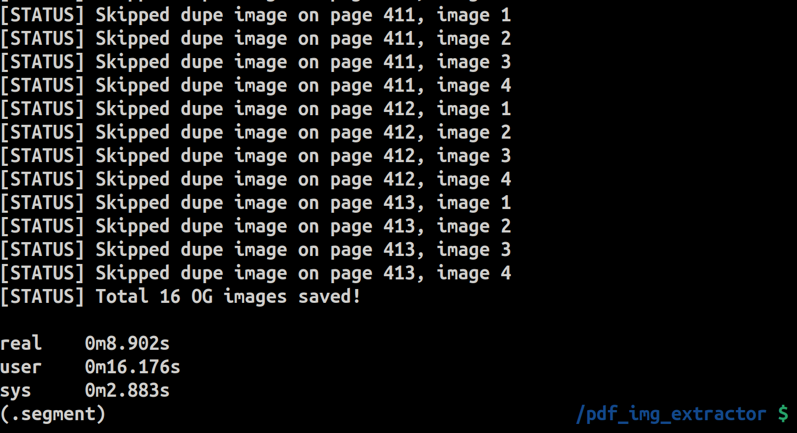

# 📄 PDF Image Extractor Program

---

#### ⚠️ Public Service Announcement   

##### Before using the **PDF Image Extractor**, ensure you have **explicit permission** to extract images from the PDF file. Unauthorized extraction may violate copyright or privacy laws. We are **not liable** for any misuse of this program. Users are **responsible** for complying with all applicable **state and federal laws and regulations**. Use this tool **ethically and responsibly**.
---

## 📝 Overview
This program extracts all images from a PDF file and saves them in a directory called `./img`. Place the .pdf file in the directory called `./pdf` in the current working directory. The program will scan the PDF file, extract all images, and save them as PNG files in the `./img` directory. Before it runs, the program will delete any images already in the `./img` directory.

---

## 📦 Requirements
- 🐍 Python 3  
- 📚 The `PyMuPDF` library for handling PDF files.  
- 🖼️ The `Pillow` library for image processing.  

---

## ⚙️ How It Works
1. 🔍 The program first checks if the `./img` directory exists.  
   - ❌ If it exists, it deletes all files in the directory to start fresh.  
   - ➕ If it doesn't exist, it creates the `./img` directory.  
2. 📂 The program lists all `.pdf` files in the `./pdf` directory.  
3. 🔢 The end-user selects a PDF file from the list.  
4. 🖼️ The program extracts all images from the selected PDF and saves them in the `./img` directory.  
5. 💾 The images are saved with filenames in the format `image_<page_number>_<image_number>.png`

---

## 📥 Installation

### 🛠️ Setting up the Python Development Environment
Follow the steps below to install and set up the development environment for this project.

1. **📦 Install required apt packages** (if using Ubuntu Linux):  

    ```bash
    sudo apt update && sudo apt install git python3 python3-dev python3-venv -y
    ```

2. **🔗 Clone the repository**:  

    ```bash
    git clone https://github.com/LinuxSystemsEngineer/pdf_img_extractor.git
    ```

3. **📂 Change directories to the newly cloned repository**:  

    ```bash
    cd pdf_img_extractor
    ```

4. **🌐 Create an isolated Python virtual environment**:  

    ```bash
    python3 -m venv .venv
    ```

5. **🚀 Activate the virtual environment**:  
   - On Linux/macOS:
    ```bash
    source .venv/bin/activate
    ```
   - On Windows:
    ```bash
    source .venv\Scripts\activate
    ```

6. **📥 Install required pip packages from the `requirements.txt` file**:

    ```bash
    pip3 install -r requirements.txt
    ```

---

### 📂 File Organization
- 📁 **PDF files**: Store your `.pdf` files in the `./pdf` directory inside the project directory.  
- 📁 **Extracted images**: The extracted images will be saved in the `./img` directory.  

---

## 🚀 Running the Program
1. 📄 Save the PDF file from which you want to extract images in the `./pdf` directory.
2. ▶️ Run the Python script:

    ```bash
    python3 pdf_img_extractor.py
    ```

3. 📑 The program will prompt you to select a PDF file. Choose the number corresponding to the PDF file from which you want to extract images.
4. 🖼️ The program will extract images from the selected PDF and save them in the `./img` directory.

---

## 📸 Screenshots




